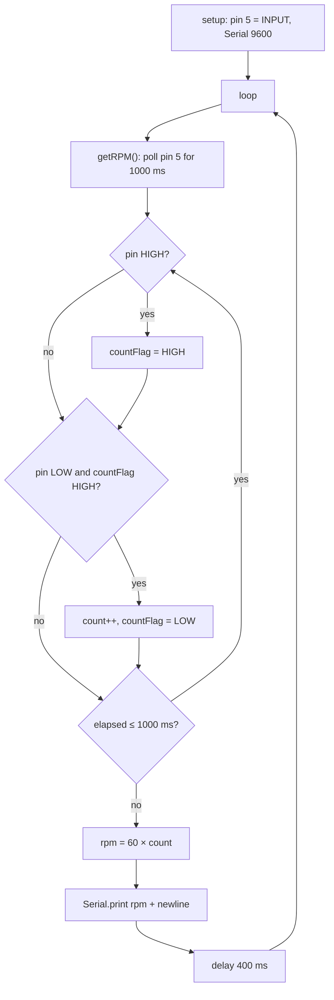

# RPM Measure — Spinner RPM Counter (Arduino)

A small Arduino sketch that measures the rotational speed (RPM) of a spinning object by counting pulses from a digital sensor on pin 5 and printing the result over the serial port.

> **Original implementation notice**
> This repository preserves the original implementation of the project. The source code has intentionally not been refactored or modernized in order to retain the historical context and original development approach.

---

## Project Overview

The whole project is a single Arduino sketch, [`spinnerRPM_v2.2.ino`](src/spinnerRPM_v2.2/spinnerRPM_v2.2.ino) (45 lines). Every loop it:

1. watches digital pin 5 for 1 second (`sampleTime = 1000` ms),
2. counts each full HIGH → LOW transition as one pulse,
3. converts the count to revolutions per minute (`RPM = 60 × pulses`),
4. prints the value to the serial port at 9600 baud,
5. waits 400 ms and repeats.

## Project Context

| Item | Value | Status |
|---|---|---|
| Project origin | **Unknown** | The repository does not include assignments, reports or notes that identify an academic or personal origin. |
| Best-fit category | Technical Experiment / small hardware prototype | Inferred from the size of the code and its purpose. |
| Author | Baruch Lopez | Confirmed (`LICENSE`, commit history) |
| Date | February 2021 | Confirmed (commit dates, `LICENSE` year) |
| Version | v2.2 | Confirmed (file name). Earlier versions are not in the repository. |
| Target object | A "spinner" | Confirmed by the file name. Whether it means a fidget spinner or another rotating part is **unknown**. |

More detail: [docs/project-context.md](docs/project-context.md).

## Problem Statement

Measure how fast something is spinning, in RPM, with low-cost hardware: a microcontroller plus a sensor that gives a digital pulse as the object passes (inferred: an IR/optical or Hall-effect module; the sensor type is not stated in the repository).

## Objective

Output a stream of RPM readings over USB serial, so they can be read in the Arduino Serial Monitor or Serial Plotter (the one-number-per-line output works with both; this use is inferred).

## Repository Structure

```
RPM_Measure/
├── README.md                     ← you are here
├── LICENSE                       ← original MIT license (2021)
├── AGENTS.md                     ← rules for automated contributors (source is read-only)
├── src/
│   └── spinnerRPM_v2.2/
│       └── spinnerRPM_v2.2.ino   ← original sketch, unchanged
└── docs/
    ├── project-context.md        ← origin, scope, evidence
    ├── code-overview.md          ← line-by-line explanation of the sketch
    ├── possible-improvements.md  ← known issues and ideas (NOT applied)
    └── sdlc/
        ├── intent.md             ← why the project exists / why it was reorganized
        ├── spec.md               ← reverse-engineered behavioral specification
        └── plan.md               ← repository reorganization plan and verification
```

The sketch lives in a folder with the same name because the Arduino IDE requires it (`<name>/<name>.ino`).

## Original Implementation

The source code represents the original implementation, uploaded on 2021-02-20. It was **moved** to `src/spinnerRPM_v2.2/` but its content is **byte-for-byte identical** to the original upload (same Git blob `2ab79fb`, SHA-256 `bad7ace4…acfea`, CRLF line endings kept). Bugs, unused variables and style have been left as they were on purpose. They are listed separately in [docs/possible-improvements.md](docs/possible-improvements.md).

## Technologies

- **Language:** Arduino C/C++ (`.ino` sketch)
- **Platform:** Arduino-compatible board. The exact board is **not stated**; the `int`-size analysis in the docs assumes an AVR board such as the Uno or Nano (inferred).
- **Arduino core API used:** `pinMode`, `digitalRead`, `millis`, `delay`, `Serial.begin`, `Serial.print`
- **External libraries:** none

## How It Works



- **Edge detection:** the sensor pin is read in a busy-wait loop (no interrupts). A pulse counts once the pin has been seen HIGH and then LOW.
- **Conversion:** `int(60000 / float(1000)) * count` → `60 * count`. This assumes **one pulse per revolution**; nothing in the code corrects for objects that produce several pulses per turn.
- **Resolution:** 60 RPM per pulse. About one reading every ~1.4 s (1 s sample + 0.4 s delay).

Full walkthrough: [docs/code-overview.md](docs/code-overview.md). Formal behavior: [docs/sdlc/spec.md](docs/sdlc/spec.md).

## Inputs and Outputs

| Direction | Interface | Details |
|---|---|---|
| Input | Digital pin **5** | Pulse signal from a sensor (sensor type not documented) |
| Output | Serial (USB), **9600 baud** | One integer RPM value per line, `\n`-terminated |

No sample output, wiring diagram or photos were included in the original repository.

## Running the Project

These are the standard Arduino steps. They follow from the code but were not tested on hardware during this reorganization.

1. Open `src/spinnerRPM_v2.2/spinnerRPM_v2.2.ino` in the Arduino IDE.
2. Select your board and port. The original board is unknown; any Arduino-compatible board with a digital pin 5 should work.
3. Connect a sensor with a **digital output** to pin 5, with the sensor's VCC and GND on the board's supply pins (inferred wiring; not documented originally).
4. Upload, then open the **Serial Monitor** (or Serial Plotter) at **9600 baud**.

## Documentation

- [Project context](docs/project-context.md)
- [Code overview](docs/code-overview.md)
- [Possible improvements (not applied)](docs/possible-improvements.md)
- [Intent](docs/sdlc/intent.md) · [Specification](docs/sdlc/spec.md) · [Plan](docs/sdlc/plan.md)

## Historical Note

This repository was later reorganized and documented to improve readability and preserve the historical context of the original project. The original source code remains unchanged. Everything outside `src/` and `LICENSE` is documentation added during that later reorganization.

## License

[MIT](LICENSE) © 2021 Baruch Lopez
