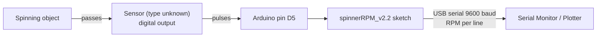

# Specification — spinnerRPM v2.2

Back to [README](../../README.md) · Previous: [Intent](intent.md) · Next: [Plan](plan.md)

> **Reverse-engineered specification.** It describes what the existing code in [`src/spinnerRPM_v2.2/spinnerRPM_v2.2.ino`](../../src/spinnerRPM_v2.2/spinnerRPM_v2.2.ino) does, not what it should do. If this document and the code disagree, the code is authoritative. Requirement IDs are for reference; they were not part of the original project.

## 1. System Context

## 2. Interfaces

| ID | Interface | Specification | Source |
|---|---|---|---|
| IF-1 | Sensor input | Digital pin 5, `INPUT` mode (no pull-up) | line 8 |
| IF-2 | Serial output | 9600 baud, ASCII decimal integer followed by `\n` (LF only) | lines 9, 16–17 |

## 3. Parameters

| Name | Value | Unit | Used | Source |
|---|---|---|---|---|
| `sampleTime` | 1000 | ms | Yes | line 2 |
| inter-sample delay | 400 | ms | Yes (literal) | line 18 |
| `maxRPM` | 10000 | RPM | **No** | line 3 |
| `rpmMaximum` | 0 | RPM | **No** | line 4 |

## 4. Functional Requirements (as implemented)

| ID | Requirement |
|---|---|
| FR-1 | On power-up, the system configures pin 5 as a digital input and opens serial at 9600 baud. |
| FR-2 | The system repeatedly performs a measurement cycle: measure, then print, then wait 400 ms. |
| FR-3 | A measurement samples pin 5 continuously (polling) while elapsed time ≤ `sampleTime`. |
| FR-4 | A pulse counts when the pin reads LOW after having been read HIGH since the last counted pulse (falling-edge detection with a latch flag). |
| FR-5 | RPM = `int(60000 / float(sampleTime)) × count` = `60 × count`. |
| FR-6 | The RPM value is sent as a decimal integer followed by a line feed. |

## 5. Non-Functional Characteristics (Observed)

| ID | Characteristic | Value |
|---|---|---|
| NF-1 | Output rate | ≈ 1 value / 1.4 s |
| NF-2 | Resolution | 60 RPM (1 pulse per window) |
| NF-3 | Measurement duty cycle | ≈ 71 % (pulses during the 400 ms delay are ignored) |
| NF-4 | Blocking | `getRPM()` blocks the CPU for the whole window |
| NF-5 | Numeric range | Result is `int`. On 16-bit AVR it is valid up to 546 pulses/s (32 760 RPM); higher values overflow. |

## 6. Assumptions

| Assumption | Status |
|---|---|
| One sensor pulse equals one revolution | Implied by the formula; whether it holds in the real setup is Unknown |
| Sensor drives the line both HIGH and LOW (push-pull) | Implied by `INPUT` without pull-up; Inferred |
| Board is an AVR Arduino (Uno/Nano class) | Inferred, not confirmed |
| Signal is clean (no bounce) | Implied by the lack of filtering |

## 7. Acceptance Checks (for anyone reproducing the device)

These checks describe the expected behavior of the unchanged sketch. They were derived from the code, not executed during the reorganization.

| ID | Given | Then |
|---|---|---|
| AC-1 | Pin 5 held constantly LOW or HIGH | Output `0` every ~1.4 s |
| AC-2 | Square wave of 20 Hz on pin 5 | Output ≈ `1200` (±60 because of window alignment) |
| AC-3 | Any input | Every output is a multiple of 60 |
| AC-4 | Serial monitor at 9600 baud | One integer per line, no other text |

## 8. Out of Scope

Display, storage, calibration, pulses-per-revolution setting, runtime configuration, and use of `maxRPM` / `rpmMaximum`.
